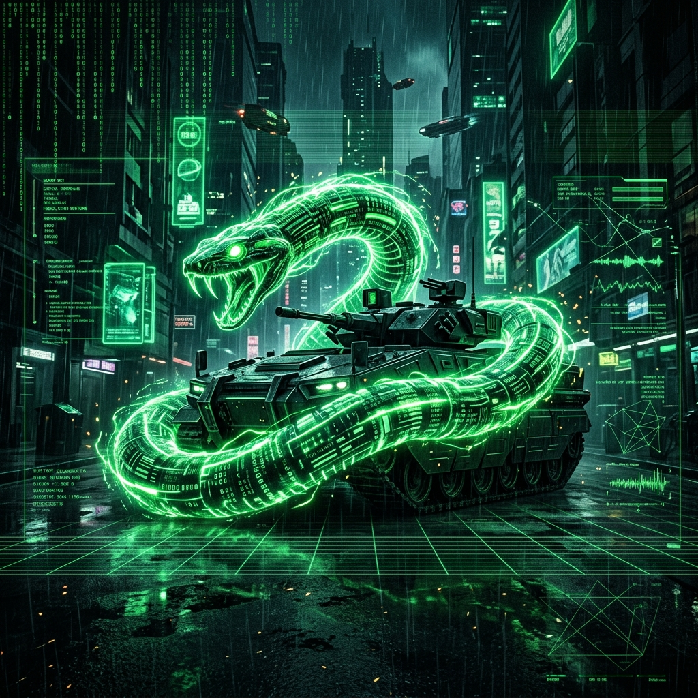
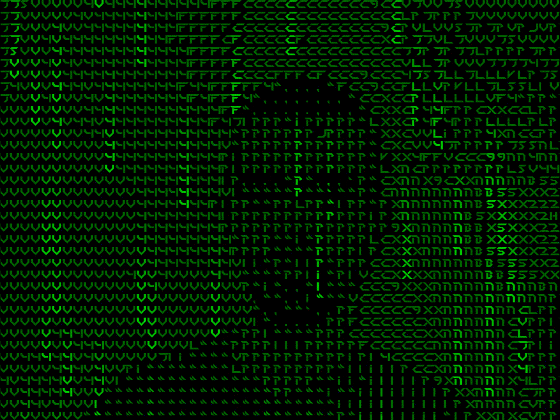

<!-- HEADER BANNER -->
<p align="center">
  
</p>

<!-- DYNAMIC TYPING TEXT -->
<p align="center">
  
</p>

<!-- THREATS INTERCEPTED (VISITOR COUNTER) -->
<p align="center">
  
</p>

<!-- MOVING HACKER ANIMATION -->
<p align="center">
  
</p>

<!-- TERMINAL INTRO BLOCK -->
```bash
SnakeTank@UniKL-MIIT:~$ ./init_profile.sh

[+] Alias       : SnakeTank
[+] Specialty   : Offensive Security & Wireless Auditing
[+] Affiliation : Bachelor in System Security @ UniKL MIIT
[+] Objective   : Red Teaming, RF Operations, Defense Evasion
[+] Status      : Active Threat Hunter // God Mode Enabled
```

<p align="center">
  
  
  
  
</p>

---

### 👤 Cyber Security Profile & Biodata

I am a **Computer Science (Information Security)** student at **UniKL MIIT** with a strong passion for **Offensive Security (Red Teaming)**, hardware auditing, and weaponized script development. In the cyber realm, I operate under the alias **SnakeTank**.

* 🛡️ **My Focus:** Wireless Auditing, RF Jamming, Active Reconnaissance, and Defense Evasion (Office Bypass).
* 🔭 **Current Goal:** Researching advanced EDR evasion and wireless network disruption.
* 💬 **Let's Talk About:** Radio Frequency operations, reverse engineering, and shellcode execution.

---

### 🛠️ Skills & Weapons

<table border="0">
  <tr>
    <td valign="top" width="50%">
      <strong>🛡️ Offensive Toolset</strong><br/>
      
      
      
      
      
    </td>
    <td valign="top" width="50%">
      <strong>💻 Coding & Evasion</strong><br/>
      
      
      
      
      
    </td>
  </tr>
</table>

---

### 🚀 Custom Developed Armaments

#### 🛜 [WiFi Bruteforce & Auditing Suite]
An automated wireless penetration testing framework designed for security assessments.
* **Key Features:** Automated WPA/WPA2 handshake capture, target selection, custom wordlist generation, and hardware-accelerated decryption verification.
* **Tech Stack:** Python, Bash, Aircrack-ng, Hashcat.

#### 🐍 [Snake Recon Tools v10 | God Mode]
An aggressive active reconnaissance engine with a custom cyberpunk-themed interactive terminal interface.
* **Key Features:** Live WHOIS details retrieval, HTTP Header analysis, DNS & Subdomain enumeration, WAF/Firewall checks, Nmap scans, and automated Directory brute-forcing.
* **Tech Stack:** HTML5, CSS3 Custom (Glitch styling, Scanline overlays), JavaScript.

#### 📑 [MS Office Defense Evasion Tool]
A proof-of-concept builder designed to audit Microsoft Office macro handling and payload execution paths.
* **Key Features:** Custom VBA obfuscation, dynamic process injection hooks, and memory-only execution vectors designed to bypass AMSI and traditional antivirus heuristics.
* **Tech Stack:** VBA, PowerShell, C++.

#### 📡 [Single Aim WiFi Jamming Rig]
A hardware-software hybrid deployment designed for targeted wireless signal suppression (de-authentication auditing).
* **Key Features:** Focused 2.4GHz/5GHz frame generation, target-specific client de-authentication (deauth), and signal strength optimization mapping.
* **Tech Stack:** Python (Scapy), ESP8266/ESP32 firmware, C++.

---

### 📶 Off-Grid Cyber Training (OSINT & CTF)

<p align="left">
  <!-- Replace the usernames below with your actual account handles to link your dynamic badges -->
  <a href="https://tryhackme.com/p/Tr00jan99" target="_blank">
    
  </a>
  <a href="https://www.hackthebox.com/" target="_blank">
    
  </a>
</p>

---

### 📊 Threat Intelligence & Metrics

<table border="0">
  <tr>
    <td valign="top" width="50%">
      <strong>📟 Language Stats (Audited)</strong><br/><br/>
      <code>Python</code> <br/>
      <code>████████████████░░░░ 80%</code><br/>
      <code>Bash Scripting</code> <br/>
      <code>██████████████░░░░░░ 70%</code><br/>
      <code>VBA / Macros</code> <br/>
      <code>████████████░░░░░░░░ 60%</code><br/>
      <code>C / C++</code> <br/>
      <code>██████████░░░░░░░░░░ 50%</code>
    </td>
    <td valign="top" width="50%">
      <strong>📈 Contribution Streak</strong><br/><br/>
      
    </td>
  </tr>
</table>

---

### 🐍 SnakeTank Contribution Game

<!-- The snake animation will be compiled daily by GitHub Actions. It will render in dark mode matching the grid layout. -->
<p align="center">
  
</p>

<br />
<p align="center">
  <sub><i>"Security is an illusion. Hack the planet." - SnakeTank</i></sub>
</p>
